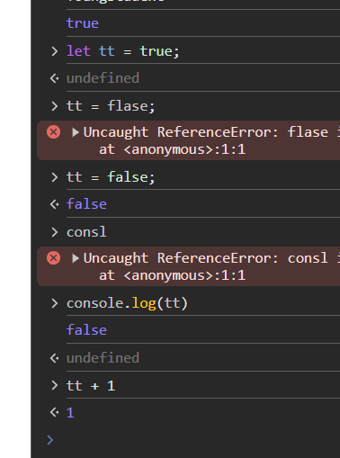
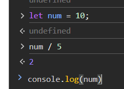
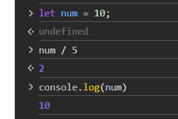
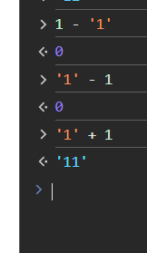
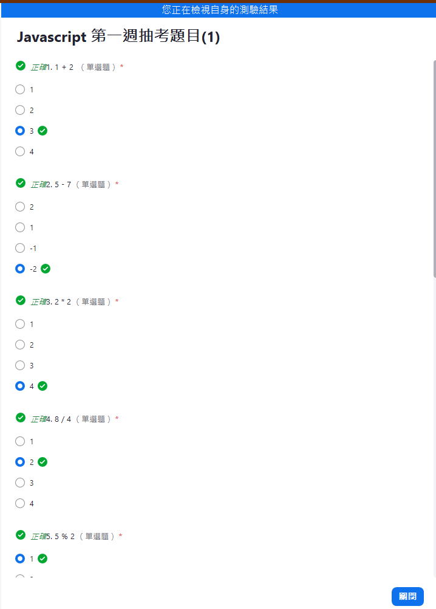
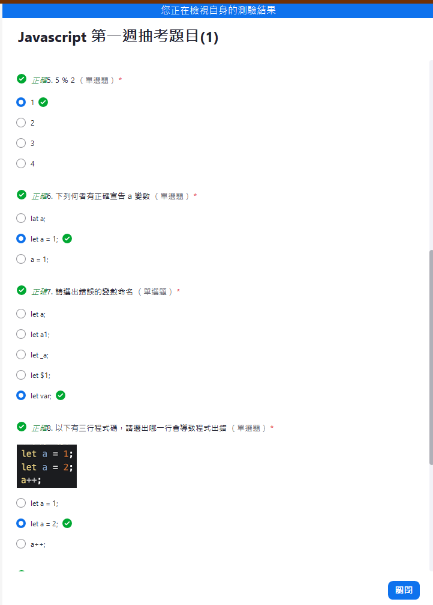
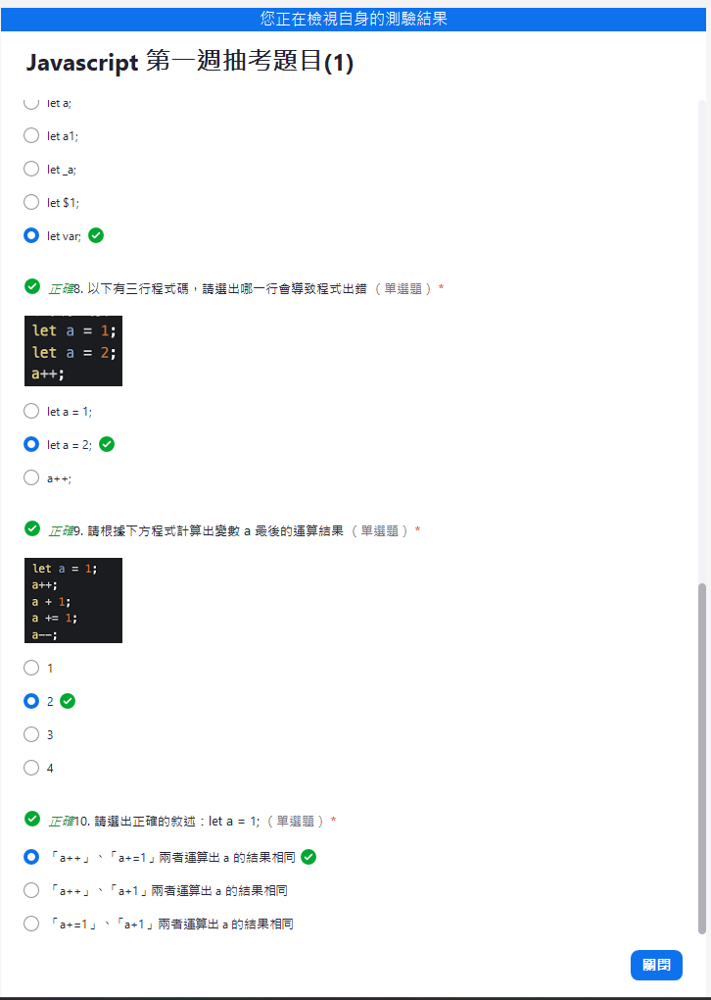
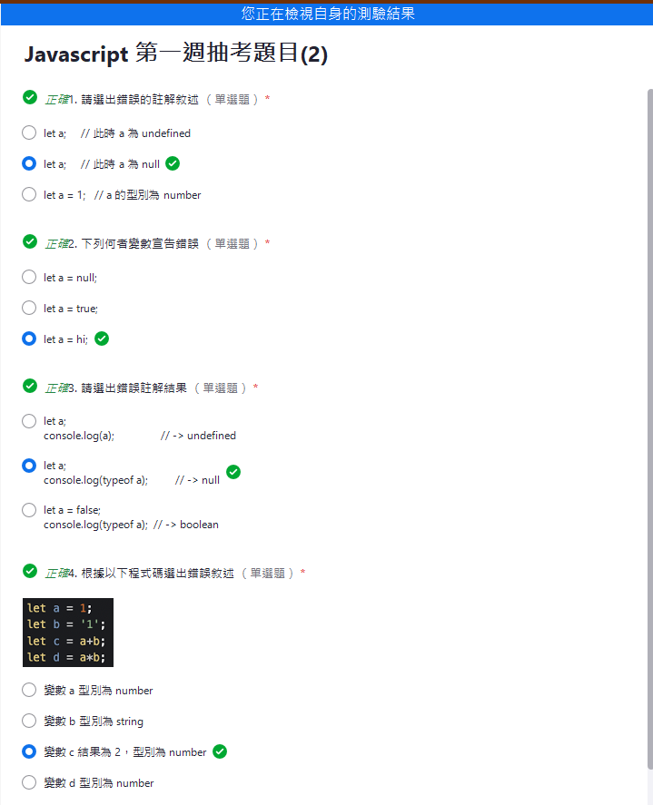
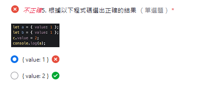

# 第一周筆記

## 變數
> 意義：變數可用來儲存值，只需宣告一次

> 解釋：將某個值賦予到某個變數，被稱為變數是因為，他所擁有的值是可以更動的，非變數本身有更動。

#### 例如：有一台電腦的價格是五萬
* 值：五萬；變數：電腦
在將五萬賦予到電腦上，需先做宣告let const的動作
因此在JS上實作就是
```
宣告 變數 賦予 值;
let computer = 50000;
const computer = 50000;
```

#### 變數宣告方式
1. 要注意是有語意的，而非都是簡稱，可用google翻譯或AI幫忙產出
    例如：u或usr(不好的變數)、userName(好的語意)
2. 小駝峰命名：代表可將不同單字串再一起，接續的單字第一個字為大寫。
    例如：fatherName、isClose
3. 大部分都是用名詞，如果是布林值則可用is/has
    例如：count(不知計算甚麼)、classCount(明顯計算班級數)
4. 區分大小寫、不可數字或某些符號開頭，也不可用JS保留字

### 算術運算子
加(+)、減(-)、乘(*)、除(/)、等於(=)、餘數(%)
有縮寫的寫法：只能加一
* += 或 ++ ，
* -= 或 --

#### 後綴：運算最後做
```
let x = 3;   
let y = x++; 
```
Step1: x 的值會先被賦予3
Step2: y 的值會被賦予到x的值，目前的x是3，所以y的值是3
Step3: 運算最後做，因此現在執行x++(x=x+1)，x的值目前是3再加上一，因此x的值改為4
#### 前綴：運算前面先做

### 變數型別
* 字串：`let myName = 'Toung'; `
    大部分都常用''單引號包住，雙引號有時候會有限制，推薦都用單引號包住，用雙引號也可，但不能同時使用
    * 字串也可相加
        ```
        let myJob = 'student';
        let myName = 'Toung';
        console.log(myName+myJob); //結果是Toungstudent
        ```
    * 遇上字串('1')跟數值(2)相加的時候，數值(2)會被轉為字串型態('2')
        ```
        '1' + 2
        - > '1' + '2' 
        - > '12'
        ```
    
* undefined 也是一個型別
* 看型別的方式：`typeof`
* 特別的是typeof Null的結果會是object，而非null，是JS的設定錯誤
* 除了原始型別 (Primitive Type)外，還有物件型別(Object Type)
## 宣告差異
有三個宣告方式，宣告時會賦予值
* undefined：代表有宣告但未定義，出現在有宣告變數但沒有賦予值，這代表還是有傳出一個值
* is not defined：代表未宣告某個變數，他抓不到，這就只有錯誤訊息，
1. let
    他比較像是暫存的盒子；置物櫃等，可更動，不可重複宣告
2. const
    上鎖的盒子；不可更動，不可重複宣告
3. var
    現在較少用，可重複宣告，後蓋前

### 物件跟陣列的差別
都是物件型別
* 陣列[]
    `const colors = ['red', 'yellow', 'black'];`
* 物件{}
    ```
    const colors = {
    red: '#FF0000',
    yellow: '#FFFF00', 
    black: '#00000' 
    };
    ```

原始傳值
物件傳址

### 陷阱題目
1. 以下JS的結果會是 10 還是 2 ？


ANS ： 還是10



???



# 隨堂考
第一次




第二次

第五題題目出錯，會再補新的



課堂講義的最後五題自己答案
10,20
'hello','hello1'
{color:'blue'},{color:'blue'}
[1,2,3,4],[1,2,3,4]
'cat','elephant'