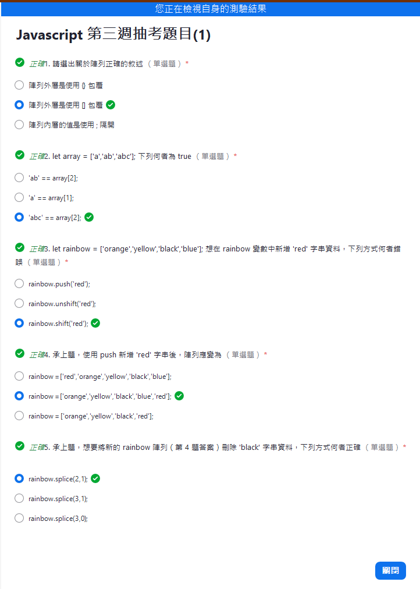

let colors = ["red","black","pink"];

* 在陣列第一個新增一個值:unshift()；()中一定會有值，才能知道要新增甚麼值
```
colors.unshift('pink');
colors = ["pink","red","black","pink"];
```

* 刪除最後一個字:pop()
```
colors.pop();
colors = ["pink","red","black"];
```

* 刪除陣列的第一個值:shift()
```
colors.shift();
colors = ["red","black"];
```

* 新增刪除指定位置:splice(開始索引值，刪除幾筆，加入的值)；刪除較常用
```
colors.splice(0,1); // 代表刪除第一筆的red
colors = ["black"];

colors.splice(0,0,'orange'); // 在第0索引值，刪除0筆，新增一個orange
```

# 物件
沒有索引值，因此也沒有順序的影響，陣列才有索引值跟順序的影響

const obj ={};
obj.age = 18; // 為何用const可更動，再查詢確認

## 測驗一


## 測驗二

## 測驗三
(41) 下列關於陣列與物件的敘述何者錯誤
		1. 陣列內可以包物件或陣列
		2. 物件內也可以包陣列或物件
		3. 物件和陣列的差別只在於一個外層是 {}，一個是 []
2 > 3
第 2 ~ 5 題為題組題，請根據下方資料回答問題
let data = [
	{
		className: 'jsLiveClass',
		toLearn: ['JS'],
		season: 'Autumn'
	},
]

(42) 此為
		1. 陣列資料
		2. 物件資料
1
(43) 想要讀取課程名稱「jsLiveClass」，下列方式何者正確
		1. data.className;
		2. data[1].className;
		3. data[0].className;
3
(44) 想要只讀取學習項目 toLearn 中的「JS」字串，下列方式何者正確
		1. data[0].toLearn;
		2. data.toLearn[0];
		3. data[0].toLearn[0];
3
(45) 想要在 data 第一個物件資料中新增一筆屬性為「year」值為「2021」的資料，下列方式何者正確
		1. data.year = 2021;
		2. data[0].year = 2021;
		3. data[0][year] = 2021;
2        